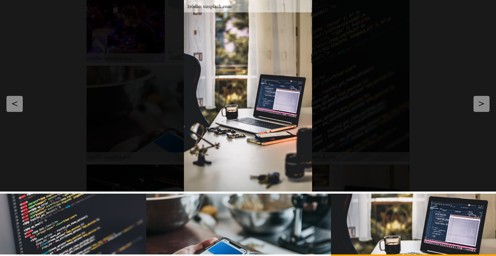

In this project, I was tasked with working on code written by another programmer. My assignment was to create a slideshow (gallery) that would be triggered by clicking on a selected photo (a <figure> element containing an  element). The client already had HTML, CSS, and JS code in place. I was asked to not modify the HTML and CSS, and to maintain the existing conventions in the JavaScript.

live view: https://beatabazyl.github.io/Slider/

The aim of this project was to find yourself in someone else's code and perform the assigned task.

👏 Thanks / Special thanks / Credits Thanks to my Mentor - devmentor.pl – for providing me with this task and for code review.
